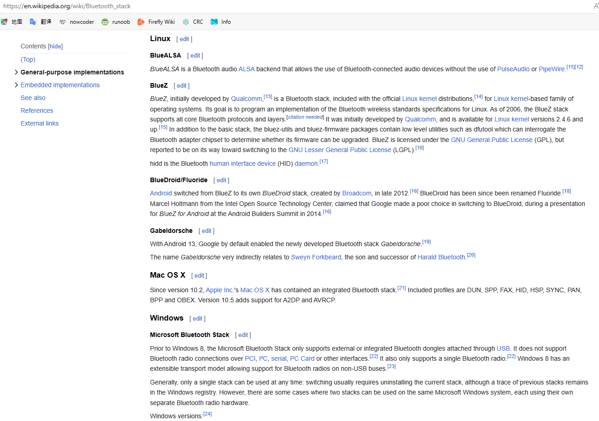

# Bluetooth stack  

  

A Bluetooth stack is software that is an implementation of the Bluetooth protocol stack.

Bluetooth stacks can be roughly divided into two distinct categories:

General-purpose implementations that are written with emphasis on feature-richness and flexibility, usually for desktop computers. Support for additional Bluetooth profiles can typically be added through drivers.
Embedded system implementations intended for use in devices where resources are limited and demands are lower, such as Bluetooth peripheral devices.[1]
General-purpose implementations
# BSD
## FreeBSD
The FreeBSD bluetooth stack is implemented using the Netgraph framework.[2] A broad variety of Bluetooth USB dongles are supported by the ng_ubt driver.[3]

The implementation was committed in 2002, and first released with FreeBSD 5.0.[4]

## NetBSD
NetBSD has its own Bluetooth implementation, committed in 2006, and first released with NetBSD § 4.0.[5]

## OpenBSD
OpenBSD has had the implementation from NetBSD for some time, but it was removed in 2014 due lack of maintainership and code rot.[6][7]

## DragonFly BSD
DragonFly BSD has had NetBSD's Bluetooth implementation since 1.11 (2008), first released with DragonFly BSD § 1.12.[8]

A netgraph-based implementation from FreeBSD has also been available in the tree since 2008, dating to an import of Netgraph from the FreeBSD 7 timeframe into DragonFly, but was possibly disabled until 2014-11-15, and may still require more work.[9][10]

#Linux
## BlueALSA
BlueALSA is a Bluetooth audio ALSA backend that allows the use of Bluetooth-connected audio devices without the use of PulseAudio or PipeWire.[11][12]

## BlueZ
BlueZ, initially developed by Qualcomm,[13] is a Bluetooth stack, included with the official Linux kernel distributions,[14] for Linux kernel-based family of operating systems. Its goal is to program an implementation of the Bluetooth wireless standards specifications for Linux. As of 2006, the BlueZ stack supports all core Bluetooth protocols and layers.[citation needed] It was initially developed by Qualcomm, and is available for Linux kernel versions 2.4.6 and up.[15] In addition to the basic stack, the bluez-utils and bluez-firmware packages contain low level utilities such as dfutool which can interrogate the Bluetooth adapter chipset to determine whether its firmware can be upgraded. BlueZ is licensed under the GNU General Public License (GPL), but reported to be on its way toward switching to the GNU Lesser General Public License (LGPL).[16]

hidd is the Bluetooth human interface device (HID) daemon.[17]

## BlueDroid/Fluoride
Android switched from BlueZ to its own BlueDroid stack, created by Broadcom, in late 2012.[16] BlueDroid has been since been renamed Fluoride.[18] Marcel Holtmann from the Intel Open Source Technology Center, claimed that Google made a poor choice in switching to BlueDroid, during a presentation for BlueZ for Android at the Android Builders Summit in 2014.[16]

## Gabeldorsche
With Android 13, Google by default enabled the newly developed Bluetooth stack Gabeldorsche.[19]

The name Gabeldorsche very indirectly relates to Sweyn Forkbeard, the son and successor of Harald Bluetooth.[20]

# Mac OS X
Since version 10.2, Apple Inc.'s Mac OS X has contained an integrated Bluetooth stack.[21] Included profiles are DUN, SPP, FAX, HID, HSP, SYNC, PAN, BPP and OBEX. Version 10.5 adds support for A2DP and AVRCP.

# Windows
## Microsoft Bluetooth Stack
Prior to Windows 8, the Microsoft Bluetooth Stack only supports external or integrated Bluetooth dongles attached through USB. It does not support Bluetooth radio connections over PCI, I²C, serial, PC Card or other interfaces.[22] It also only supports a single Bluetooth radio.[22] Windows 8 has an extensible transport model allowing support for Bluetooth radios on non-USB buses.[23]

Generally, only a single stack can be used at any time: switching usually requires uninstalling the current stack, although a trace of previous stacks remains in the Windows registry. However, there are some cases where two stacks can be used on the same Microsoft Windows system, each using their own separate Bluetooth radio hardware.

Windows versions:[24]

Windows 2000 or Windows ME : Microsoft has not released an official Bluetooth stack for these old Windows versions.
Windows Embedded Compact (formerly Windows CE) supports UART, USB, SDIO, and BCSP connections.[25] Third party stacks can also be installed on Windows CE devices, including Widcomm, BlueSoleil and Toshiba, depending on the embedded device and which version of the OS is installed.
Windows XP had a built-in Bluetooth stack starting with the Service Pack 2 update, released on 2004-08-06. Windows XP SP2 and SP3 support Bluetooth 1.1 (but not 1.0), Bluetooth 2.0 and Bluetooth 2.0+EDR (Enhanced Data Rate). Profiles can be toggled in the "Services" tab of each Bluetooth Device to disable unsupported profiles. [26]
Windows XP SP1 : Microsoft released a QFE of its Bluetooth stack (labelled as QFE323183) to install onto Windows XP Service Pack 1. Microsoft only released this directly to third-party companies and did not directly release it to the public. The third-party companies were then allowed to release the QFE as part of their own Bluetooth device's software installation. Microsoft no longer supports this QFE.
The Windows Vista Bluetooth stack is improved, with support for more hardware IDs, EDR performance improvements, Adaptive frequency hopping for Wi-Fi co-existence, and Synchronous Connection Oriented (SCO) protocol support which is needed for audio profiles.[22] The Windows Vista Bluetooth stack supports a kernel mode device driver interface besides the user-mode programming interface, which enables third parties to add support for additional Bluetooth Profiles. This was lacking in the Windows XP Service Pack 2 built-in Bluetooth stack, which had to be entirely replaced by a third-party stack for additional profile support. It also provides RFCOMM support using sockets besides virtual COM ports.[27] KB942567 called Windows Vista Feature Pack for Wireless adds Bluetooth 2.1+EDR support and remote wake from S3 or S4 support for self-powered Bluetooth modules.[22] This feature pack while initially only available to OEMs, was eventually included in Windows Vista Service Pack 2.
Windows 7 supports Bluetooth 2.1+EDR (like Windows Vista).[26] Windows 7 introduces Secure Simple Pairing, Extended Inquiry Response and other UI and USB Bluetooth radio installation improvements. Secure Simple Pairing auto determines the best pairing method, Extended Inquiry Response provides more information during the inquiry procedure to allow better filtering of devices before connection.[26] In Windows 7, Bluetooth device settings have been moved to Devices and Printers from the Control Panel applet.
Windows 8 expands its Bluetooth stack with support for Bluetooth 4.0 which includes Bluetooth Low Energy (BLE).[28]
Windows 8.1 added developer APIs for Bluetooth Low Energy (GATT) and RFCOMM.
Windows 10 converged the Windows Phone and Windows Bluetooth stacks.
Note : The Windows XP/Vista Windows Vista/Windows 7 Bluetooth stack supports the following Bluetooth profiles natively: PANU, SPP, DUN, OPP, OBEX, HID, HCRP.[22][23][26] Windows 8 adds support for HFP, A2DP, and AVRCP Profiles.[23]

The Windows 7/Vista/8/10 stack provides kernel-mode and user-mode APIs for its Bluetooth stack- so hardware and software vendors can implement additional profiles.[23]

Windows 10 (Version 1803) and later support Bluetooth version 5.0 and several Bluetooth profiles.[29]

## Broadcom WIDCOMM (BTW)
WIDCOMM was the first Bluetooth stack for the Windows operating system. The stack was initially developed by a company named WIDCOMM Inc., which was acquired by Broadcom Corporation in April 2004.[30] Broadcom continues to license the stack for inclusion with many Bluetooth-powered end-user devices like Qualcomm Atheros, Realtek, Ralink.

An API is available for interacting with the stack from a custom application. For developers there is also a utility named BTServer Spy Lite bundled with the stack (some vendor-tied versions excluded) which monitors Bluetooth activity on the stack at a very low level — although the category and level of trace is configurable. This stack also allows use of RFCOMM without creating a virtual serial port in the operating system.

Toshiba Bluetooth Stack
In 2001, Toshiba first announced a notebook design that would integrate a Bluetooth antenna inside the lid. Toshiba then went on to release the first two notebook models to offer dual Bluetooth/Wi-Fi integration.[31]

Toshiba has created its own Bluetooth stack for use on Microsoft Windows. Toshiba licenses their stack to other original equipment manufacturers (OEM) and has shipped with some Fujitsu Siemens, ASUS, Dell and Sony laptops. A non-disclosure agreement must be signed to obtain the API. The Toshiba stack is also available with certain non-OEM Bluetooth accessories such as USB Bluetooth dongles and PCMCIA cards from various vendors.

The Toshiba stack supports one of the more comprehensive list of Bluetooth profiles including: SPP, DUN, FAX, LAP, OPP, FTP, HID, HDP, HCRP, PAN, BIP, HSP, HFP (including Skype support), A2DP, AVRCP.

The latest version of the Toshiba stack is 9.20.02(T), released on 30 September 2016.

## CSR Harmony
In 2010 CSR plc (formerly Cambridge Silicon Radio) created its own Bluetooth stack.[32] It was based on CSR Synergy BT host stack. CSR was acquired by Qualcomm in August 2015.[33]

## IVT BlueSoleil (1000Moons)
BlueSoleil (marketed as 1000Moons in China) is a product of IVT Corporation, which produces stacks for embedded devices and desktop systems. The stack is available in both standard and VOIP versions. It supports the profiles A2DP, DUN, FAX, HFP, HSP, LAP, OBEX, OPP, PAN, SPP, AV, BIP, FTP, HID and SYNC.

An SDK for third-party application developers is available for non-commercial use at the BlueSoleil download site, but this API will only work with the non-free version of the stack, BlueSoleil 6.4 and above.

As of April 2018, the latest version of the global BlueSoleil stack is 10.0.497.0, released on 8 January 2018. The Chinese 1000Moons stack is at version 10.2.497.0, released on 9 January 2018.

## AVM BlueFRITZ!
BlueFRITZ! was the stack supplied with the USB Bluetooth dongles from the German manufacturer AVM GmbH. It supported the profiles SPP, DUN, FTP, FAX and some more. HID was not supported. This stack could be switched into a mode where it is off and the Microsoft stack is used instead. Development of this stack has been aborted.

## Digianswer BTSWS
Digianswer was a subsidiary of Motorola, Inc. since 1999.[34] Digianswer Bluetooth Software Suite (BTSWS) was marketed and sold through OEM customers such as Motorola, Dell and IBM, which bundled PCMCIA and USB products together with BTSWS. The product has been available since August 2000.[35]

# Embedded implementations
## Apache Mynewt NimBLE
Apache Mynewt NimBLE is a full-featured, open source Bluetooth Low Energy 4.2 and 5.0 protocol stack written in C for embedded systems. NimBLE is one of the most complete protocol stacks, supporting 5.0 features including high data rate and extended advertising. The implementation supports all layers of the Bluetooth protocol. The first ports for the Controller part are to nRF51 series and nRF52 SoCs from Nordic Semiconductor. NimBLE also supports standard HCI interfaces to work with controllers, including ST, Dialog and Em Micro chipsets. It leverages the open source Apache Mynewt OS which is designed to support multiple microcontroller architectures.[36] NimBLE can also run with FreeRTOS and is portable to other real-time operating systems. The implementation allows for the Mynewt NimBLE Controller part to be used with a non-Mynewt NimBLE Host.

## BlueCode+
BlueCode+ is the portable higher layer Bluetooth protocol stack from Stollmann E+V GmbH. BlueCode+ 4.0 is qualified to Bluetooth version 3.0.[37] The protocol stack is chipset and operating system independent and supports any Bluetooth HCI chips available. The APIs offer control of the profiles and stack functions, as well as direct access to lower level functions. BlueCode+ 4.0 supports the protocols L2CAP, eL2CAP, RFCOMM, SDP Server and Client, MCAP, HCI-Host Side and AVDTP. Supported profiles are Generic Access (GAP), Service Discovery Application (SDAP), Serial Port Profile (SPP), Health Device Profile (HDP), Device Identification Profile (DID), Dial-up Networking (DUN), Fax, Headset (HSP), Handsfree (HFP), SIM Access (SAP), Phone Book Access (PBAP), Advanced Audio Distribution Profile (A2DP), Audio/Video Remote Control (AVRCP) and OBEX. The stack has been ported to a wide range of different microcontrollers and operating systems.

BlueCore Host Software (BCHS) a.k.a. CSR Synergy
CSR's BCHS or BlueCore Host Software (now called CSR Synergy) provides the upper layers of the Bluetooth protocol stack (above HCI, or optionally RFCOMM) - plus a large library of Profiles — providing a complete system software solution for embedded BlueCore applications. Current qualified Profiles available with BCHS: A2DP, AVRCP, PBAP, BIP, BPP, CTP, DUN, FAX, FM API, FTP GAP, GAVDP, GOEP, HCRP, Headset, HF1.5, HID, ICP, JSR82, LAP Message Access Profile, OPP, PAN, SAP, SDAP, SPP, SYNC, SYNC ML.[38]

## Bluelet
Bluelet is a portable embedded Bluetooth protocol stack of Barrot Technology Limited with efficient, reliable, and small features. Bluelet is perfectly compatible with BREDR/LE profiles. Bluelet can easily be ported to different platforms, i.e., Linux, RTOS, Android. This offering includes the latest full implementation of Bluetooth 5.3 host using ANSI C, implementing all LE Audio Profiles / Services (BAP, PACS, ASCS, BASS; CSIP/CSIS; CCP/TBS; MCP/MCS; MICP/MICS; VCP/VCS/VOCS/AICS; TMAP, HAP/HAS; CAP) and the MESH stack.[39]

## BlueMagic
BlueMagic 3.0 is Qualcomm's (formerly Open Interface North America's) highly portable embedded Bluetooth protocol stack which powers Apple's iPhone and Qualcomm-powered devices such as the Motorola RAZR. BlueMagic also ships in products by Logitech, Samsung, LG, Sharp, Sagem, and more. BlueMagic 3.0 was the first fully certified (all protocols and profiles) Bluetooth protocol stack at the 1.1 level.[40]

## Blue SDK
OpenSynergy's Bluetooth Protocol Stack (Blue SDK) currently provides A2DP, AVRCP, VDP, BIP, BPP, CTN, FTP, GPP, HFP, HSP, HCRP, HDP, HID, MAP, OPP, PAN, PBAP, SAP, DUN, FAX, DID, GATT profiles. It is licensed by the Bluetooth™ Special Interest Group (SIG) and meets the standards of safety and security expected in automotive-grade products. Bluetooth™ Software Development Kit (Blue SDK) can easily be integrated into any operating system. It supports both BR/EDR (Classic) and Low Energy operations, classic profiles and low energy profiles use the same underlying protocol stack software.[41]

## Bluetopia
Bluetopia is Stonestreet One's implementation of the upper layers of the Bluetooth protocol stack above the HCI interface and has been qualified to version 4.0 and earlier versions of the Bluetooth specification. The Application Programming Interface (API) provides access to all of the upper-layer protocols and profiles and can interface directly to the most popular Bluetooth chips from Broadcom, CSR, TI, and others. Bluetopia has been ported to multiple operating systems such as Windows Mobile/Windows CE, Linux, QNX, Nucleus, uCOS, ThreadX, NetBSD, and others. Bluetopia is currently shipping in devices from companies such as Motorola, Kodak, Honeywell, Garmin, VTech, and Harris.

Stonestreet One was acquired by Qualcomm in 2014. Texas Instruments provides its version of the Bluetopia stack for use with TI Bluetooth chips.

## BlueWiseLE
BlueWiseLE is the Bluetooth® Low Energy certified protocol stack software product from Alpwise. It includes the Link Layer[42] and also the Host stack (i.e. upper layers above the HCI).[43] The Link Layer controls the radio and the timing of the Bluetooth® communication in three possible chipset configurations: SoC, co-processor or HCI. Several proprietary BLE profiles are also available including Voice over BLE and Firmware update Over the Air (FOTA).[44]

## ClarinoxBlue
Bluetooth host subsystem product of Clarinox Technologies. Support for Windows 7/8/10, WinCE, Linux/AGL Linux, Android, AutoSAR, Integrity, SafeRTOS, QNX, µITRON, FreeRTOS, µC/OS, Azure RTOS ThreadX, Nucleus, MQX, RTX, embOS, TI-RTOS, DSP/BIOS, eCos and µ-velOSity. Qualified for Bluetooth specification 5.2,5.0 and all previous specifications includes all Classic profiles/protocols and LE profiles/services including BT & LE Audio. ClarinoxBlue supports HCI transport for SDIO, UART 3-Wire, UART-BCSP, UART-H4, USB. The stack has been ported to many CPU and MCU families including NXP i.MX6/i.MX7/i.MX8/i.MX RT, Kinetis K6x/7x, LPC 18xx/43xx/54xxx STMicro; STM32F4x, STM32H7, STM32WB55, STM32MP157; Texas Instruments TI MSP432, DSP 5xxx, OMAP/Davinci, Tiva TM4C123x, Sitara 3xxx; Renesas Synergy S5/S7, RH850, R-Car M3/H3; Xilinx PowerPC, soft core SPARC LEON. ClarinoxBlue Bluetooth host system is provided with ClariFi debug tool, in-built protocol analyzer, supports faster debugging of complex wireless devices. ClariFi offers threading, memory usage, memory leak analysis and audio analysis to support the tuning of applications and aid in the communication of issues.[45]

## dotstack
dotstack, a dual mode Bluetooth stack by SEARAN, is a good fit for low cost and low power embedded devices, tested with iPhone (uses SEARAN's IAP), Android and other mobile platforms. dotstack is qualified as V2.1 + EDR, V4.1, V4.2 and 5.0 ready, with SPP, GAP, HID, Headset, HFP, FTP, HDP, PBAP, Simple Secure Pairing, A2DP, AVRCP, PAN, MAP, BLE (GATT) with ANP/ANS, FMP, HIDS, HOGP, PASP/PASS, PXP, TIP, BAS, DIS, IAS, LLS, TPS, ANCS, BLP/BLS, GP, HTP, HRP/HRS. dotstack is ported to platforms from, ST Micro (STM32L1/4, STM32F0/1/2/3/4), Microchip (PIC24, dsPIC, PIC32), NXP (LPC), Energy Micro (EFM32), TI (MSP430, C5000 etc.), Renesas (RX, SH-2A, M2 ARM Cortex A15, R-Car), and tested with Bluetooth RF controllers, CSR8811/8311/8510, BlueCore 4 & 6, TI CC2560/2564, Intel/Infineon PMB8753, Marvell Avastar 88w8777, 88W8790, Toshiba TC35661, Microchip/ISSC IS1662. dotstack has FreeRTOS, uOS, Linux, Android, QNX, MQX, ThreadX, and no RTOS integration. Min RAM requirement for SPP 3KB with RTOS and app.[46]

## EtherMind stack
EtherMind from MINDTREE Ltd is a BT-SIG qualified Bluetooth Stack and Profile IP offering.[47]

Mindtree's EtherMind Stack supports all popular versions of Bluetooth specifications (2.1+EDR, v4.0, v4.1, v4.2, 5.0, 5.1 and 5.2) and includes all mandatory and optional features of the core stack and all the adopted profiles are supported as part of EtherMind. The stack supports the latest adopted version of 23 Bluetooth Classic Profiles[48] such as A2DP, AVRCP, etc.; and 54 Bluetooth Low Energy Profiles & Services[49] such as Location and Navigation Profile, Weight Scale Profile/Service, etc. The offering includes the latest Mesh[50] and IPv6 Stack[51] over Bluetooth Smart capabilities.

## Jungo BTware
Jungo's Bluetooth Protocol Stack BTware allows device manufacturers to easily incorporate standard Bluetooth connectivity in their designs, including mobile handsets, automotive infotainment systems, set top boxes and medical devices. BTware supports standard HCI as well as proprietary HCI. Supported protocols: L2CAP, RFCOMM, AVDTP, AVCTP, BNEP, MCAP. Supported profiles: GAP, A2DP, AVRCP, HSP, HFP, SPP, DUN, HID, PAN, HDP, PBAP, OPP, FTP, MAP and others. Jungo has discontinued distributing BTware.

## lwBT
lwBT is an open source lightweight Bluetooth protocol stack for embedded systems by blue-machines. It acts as a network interface for the lwIP protocol stack.

It supports some Bluetooth protocols and layers, such as the H4 and BCSP UART layers. Supported higher layers include: HCI, L2CAP, SDP, BNEP, RFCOMM and PPP. The supported profiles are: PAN (NAP, GN, PANU), LAP, DUN and Serial Port.

lwBT has been ported to the Renesas M16C, used on the Mulle platform, line of microcontrollers, and Linux as well as Windows. The source code was also available for use.

A fork of lwBT can be found in the GitHub repository because Googlecode is gone.[52]

## Mecel/Aricent Betula
Mecel Betula is aAd x86 compatible. It also ported to a wide range of operating systems, such as Windows, Linux, Android or running without or with a custom OS. It has support for Bluetooth version 4.0, including the new Bluetooth Low Energy.[53] Supported profiles are HSP, DUN, FAX, HFP, PBAP, MAP, OPP, FTP, BIP, BPP, SYNC, GAVDP, A2DP, AVRCP, HID, SAP, PAN.

Silvair Mesh Stack
Silvair Mesh Stack is an implementation of Bluetooth MESH profile and Models, developed primarily for Smart lighting applications. Apart from core mesh node features it implements Light Lightness Server model, Light Controller model and Sensor Server model so that it may be used to build dimming luminaires and daylight harvesting sensors. It provides PWM/0-10V output for direct dimming control and UART interface for integration purposes. DALI output is marked as planned.[54]

Silvair Mesh Stack has been qualified by Bluetooth SIG on 2017-07-18 with QDID 98880, as a first Bluetooth mesh node implementation.[55]

## SurfBlue
Siemens' implementation of the blue2net access point.

## Symbian OS
Symbian OS was an operating system for mobile phones, which includes a Bluetooth stack. All phones based on Nokia's S60 platform and UIQ Technology's UIQ platform use this stack. The Symbian Bluetooth stack runs in user space rather than kernel space, and has public APIs for L2CAP, RFCOMM, SDP, AVRCP, etc. Profiles supported in the OS include GAP, OBEX, SPP, AVRCP, GAVDP, PAN and PBAP.[56] Additional profiles supported in the OS + S60 platform combination include A2DP, HSP, HFP1.5, FTP, OPP, BIP, DUN, SIM access and device ID.[57][58]

## Zephyr Project
The Zephyr Project RTOS includes a complete, open source Bluetooth Low Energy v5.3[59] compliant protocol stack written in C for embedded systems. It contains both a BLE Controller and a BLE and BR/EDR capable Host running on nRF51 Series and nRF52 SoCs from Nordic Semiconductor.